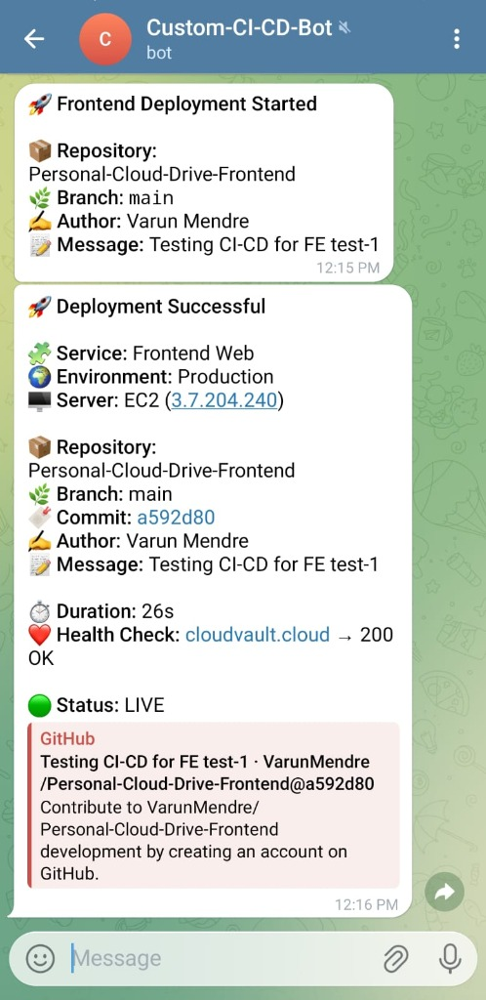
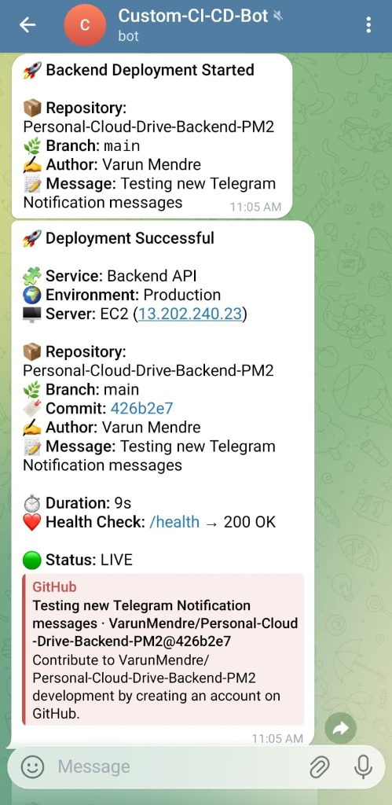

# 🚀 Custom Node.js CI/CD Server

A lightweight, robust, and custom-built CI/CD system designed for automating deployments for personal projects. This system listens for GitHub webhooks, verifies signatures, triggers remote deployment scripts on AWS EC2 via SSH, and provides real-time status updates via Telegram.

> [!IMPORTANT]
> This system is optimized for performance on memory-constrained environments (like AWS EC2 t2.micro) using swap-space strategies and efficient `npm ci` execution.

---

## 📸 Visual Evidence (Telegram Notifications)

Check out how the system keeps you informed during deployments:

| Frontend Deployment | Backend Deployment |
| :---: | :---: |
|  |  |

---

## 🏗️ Architecture & Workflow

The system is split into two main components:

### 1. CI/CD Server (The Orchestrator)
- **Role**: Receives webhooks, validates GitHub signatures, and manages the deployment flow.
- **Tech Stack**: Node.js, Express, Axios (for Telegram), `child_process` (for SSH).
- **Security**: Implements `x-hub-signature-256` verification to ensure requests only come from GitHub.

### 2. Target Server (The Application Host)
- **Role**: Hosts the actual Frontend and Backend applications.
- **Tools**: PM2 (Process Management), Nginx (Reverse Proxy).
- **Optimization**: Uses custom bash scripts for atomic updates and swap files for OOM (Out Of Memory) prevention.

### 🔄 Deployment Lifecycle
1.  **Git Push**: Code is pushed to the `main` branch.
2.  **Webhook Call**: GitHub triggers a POST request to `/github-webhook`.
3.  **Signature Verification**: CI/CD server verifies the payload.
4.  **Telegram - Started**: An instant "Deployment Started" notification is sent.
5.  **SSH Execution**: CI/CD server executes `bash ~/deploy-frontend.sh` or `bash ~/deploy-backend.sh` on the target server.
6.  **Remote Steps**:
    - `git pull` latest changes.
    - `npm ci` (clean install) if `package-lock.json` has changed.
    - `pm2 reload` for zero-downtime deployment.
7.  **Health Check**: The system verifies the app is LIVE.
8.  **Telegram - Success**: A detailed "Deployment Successful" message with commit hash and duration.

---

## 📂 Project Structure

```text
Custom-CI-CD-Server/
├── assets/images/          # Deployment screenshots
├── src/
│   ├── controllers/        # Business logic for FE/BE webhooks
│   ├── middlewares/        # GitHub signature verification
│   ├── routes/             # Webhook and Health endpoints
│   ├── services/           # Telegram notification service
│   ├── utils/              # SSH/Deployer utilities
│   ├── app.js              # Express app configuration
│   └── server.js           # Server entry point
├── ecosystem.config.js     # PM2 configuration
└── README.MD               # Project documentation
```

---

## 🛠️ Setup Instructions

### 1. Environment Configuration
Create a `.env` file in the root based on `.env.example`:
```env
PORT=3000
GITHUB_WEBHOOK_SECRET=your_secret_here
TELEGRAM_BOT_TOKEN=your_bot_token
TELEGRAM_CHAT_ID=your_chat_id
DEPLOY_SERVER_USER=ubuntu
DEPLOY_SERVER_IP=your_target_ip
```

### 2. GitHub Webhook Setup
- **Payload URL**: `http://<CICD_SERVER_IP>:3000/github-webhook/[frontend|backend]`
- **Content Type**: `application/json`
- **Secret**: Must match `GITHUB_WEBHOOK_SECRET`.

### 3. Server-Side Prep
On the target server, ensure your deployment scripts exist at `~/deploy-frontend.sh` and `~/deploy-backend.sh`.

---

## 🚀 Features
- ✅ **Automated Workflows**: Zero manual intervention after `git push`.
- ✅ **Telegram Integration**: Instant feedback loop in your pocket.
- ✅ **Security First**: Cryptographic validation of all incoming webhooks.
- ✅ **Performance Focused**: Minimal footprint, designed for small EC2 instances.
- ✅ **PM2 Integration**: Zero-downtime reloads.

---
*Developed with focus on Automation and Reliability by Varun Mendre*
